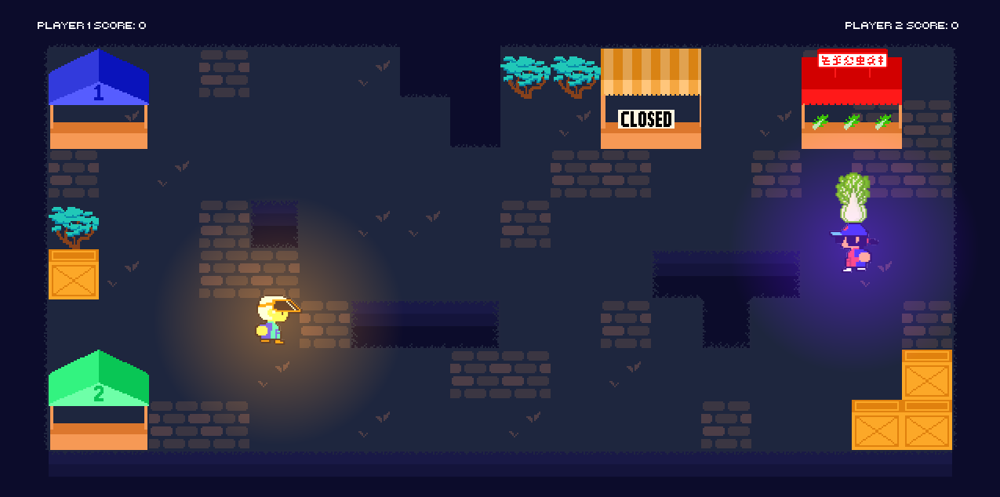

Presented by SOYA Studios! (CS/INFO 3152 Group 11)

## Goal
- Run to the food item and bring it back to your home stall to get a point
- Maneuver around obstacles and defend against enemies using your wok
- Make it to **three points** before time runs out to win the level!

## Controls

### Level selection

- Change level: `A/D`
- Select level: `Space`

### Gameplay

- Walk: `WASD`
- Dash: While walking, `Left Shift`
- Grab: `Space`
- Throw: While walking, `Space`
- Deflect: `Left Mouse Button`

Notes:
- Dash and Deflect don't work when you have an item
- Deflect goes in the direction of the cursor

### Other

- Debug: `Y`
- Return to level selection: `R`
- (Un)mute music: `M`
